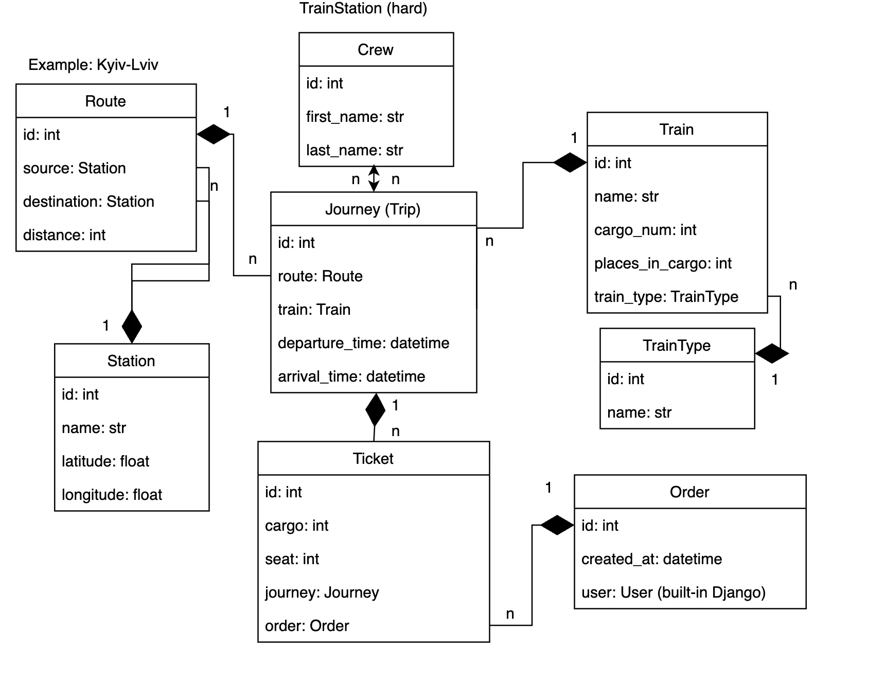

# Train Station Management System

Manage train stations, routes, journeys, tickets, and more with ease!

## Project Description

The Train Station Management System is a robust platform designed for managing train operations, from defining train routes and schedules to handling ticket orders and ensuring smooth operations of train journeys. This system streamlines the management of stations, trains, and ticketing for an efficient and user-friendly experience.

## Features

* **Station Management**: Add, edit, and delete train stations with geographical coordinates for precise mapping.
* **User Registration and Profile Management**: Secure registration and profile management using JWT authentication for users and admins.
* **Role-based Access Control**: Different levels of access for admins and users.
* **Route Management**: Define routes between stations with specified distances.
* **Train Management**: Manage train details, including type, number of cargoes, seats per cargo, and images.
* **Journey Scheduling**: Plan and manage train journeys, including departure and arrival times, and assign train crews.
* **Ticket Booking**: Book tickets with seat and cargo validation to prevent overlaps or errors.
* **Order Management**: Track and manage user orders and associated tickets.
* **Crew Management**: Manage train crew details, including their names and assignments to journeys.
* **Data Integrity**: Enforce unique constraints for tickets, routes, and other models to ensure consistent and error-free operations.
* **Custom Validation**: Validate seat and cargo allocations dynamically based on train configuration.
* **Admin Controls**: Utilize Django's admin interface to manage all aspects of the system, including user management.

## Technological Stack

* **Backend**: Django (Django REST Framework for API development)
* **Database**: PostgreSQL
* **Environment Management**: Python Virtual Environment (venv)
* **Version Control**: Git, GitHub
* **API Documentation**: Swagger (optional, if integrated)
* **Containerization**: Docker (optional)

## Installation Instructions

Install PostgreSQL and create the database:

1. **Clone the repository:**
    ```shell
    git clone https://github.com/Viesich/train-station.git
    cd train_station
    ```

2. **Set up a virtual environment:**
    ```shell
    python3 -m venv venv
    source venv/bin/activate  # For Unix or MacOS
    venv\Scripts\activate  # For Windows
    ```

3. **Install the required packages:**
    ```shell
    pip install -r requirements.txt
    ```

4. **Create a .env file in the root directory of the project:**

    Example of `.env` file:
    ```plaintext
    POSTGRES_PASSWORD=<your_postgres_password>
    POSTGRES_USER=<your_postgres_user>
    POSTGRES_DB=<your_postgres_database>
    POSTGRES_HOST=<your_postgres_host>
    POSTGRES_PORT=5432
    PGDATA=/var/lib/postgresql/data
    ```

5. **Apply migrations to set up the database schema:**
    ```shell
    python manage.py migrate
    ```

6. **Run the server:**
    ```shell
    python manage.py runserver
    ```

## Run with Docker

Make sure **Docker** is installed.

Build and run with Docker:
```shell
docker-compose build
docker-compose up
```

## Database Schema

Below is a simplified representation of the database schema:


   ```plaintext
   Runner
   - id (Primary Key)
   - first_name
   - last_name
   - city
   - date_of_birth
   - gender
   - phone_number
   
   Station
   - id (Primary Key)
   - name (Unique)
   - latitude
   - longitude
   
   Route
   - id (Primary Key)
   - source (Foreign Key to Station)
   - destination (Foreign Key to Station)
   - distance
   
   Train
   - id (Primary Key)
   - name (Unique)
   - cargo_num
   - places_in_cargo
   - train_type (Foreign Key to TrainType)
   - image
   
   TrainType
   - id (Primary Key)
   - name
   
   Journey
   - id (Primary Key)
   - route (Foreign Key to Route)
   - train (Foreign Key to Train)
   - departure_time
   - arrival_time
   - crews (Many-to-Many to Crew)
   
   Crew
   - id (Primary Key)
   - first_name
   - last_name
   
   Order
   - id (Primary Key)
   - user (Foreign Key to User)
   - created_at
   
   Ticket
   - id (Primary Key)
   - cargo
   - seat
   - journey (Foreign Key to Journey)
   - order (Foreign Key to Order)
   ```

